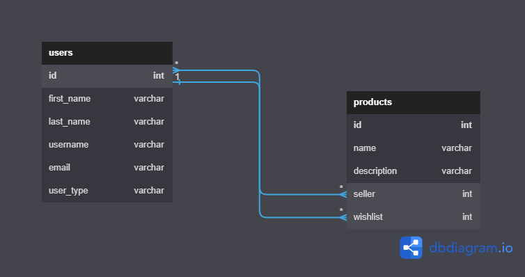

# Ecommerce

This is a simple multi-vendor multi-vendor ecommerce website with custom authentication.

## Database Design

The implemented database tables are:

  1. Users table.
  2. Products table.

  

## Groups and permissions

* When a new user registers an account, they can choose the account type (seller, buyer) and based on the account type attribute the user is assigned to their respective group (Buyer or seller groups) each with their own permissions.
* the seller group can add products and view their products. and the buyer group can view products and add products to the wish lists.

## Endpoints

|Endpoint|Method|Description|
|-|-|-|
|`/api/register/`|`POST`|register new users send back JWT|
|`/api/login/`|`POST`|log in users and send back JWT|
|`/api/login/refresh/`|`POST`|Generate a new access token.|
|`/api/products/`|`GET`|list all available products.|
|`/api/product/<str:name>/`|`GET`, `PATCH`|view product and add product to wish list|
|`/api/seller-products/`|`GET`, `POST`|list all seller products and add new products|
|`api/wishlist/`|`GET`|show buyer wishlist|
|`api/users/`|`GET`|list all users (only admins can use this route)|
